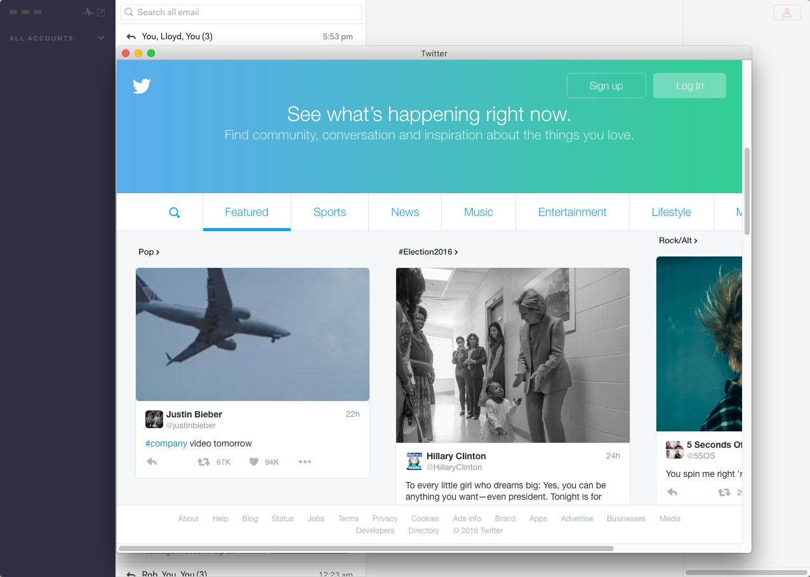

# Nylas N1 Background Webpage Plugin
  Open a webpage in separate window while using Nylas N1. Great for keeping your favorite calendar, project management tool, or even Slack running within N1!

  

  ## Installation
  1. Download [Nylas N1](https://nylas.com/n1)
  2. Download or clone this repo.
  3. In `lib > main.js`, line 21, insert the URL of the webpage you want loaded
  4. In the N1 menu, select `Developer > Install a Package Manually...` and locate the directory for this plugin.
  5. Done! :tada: :thumbsup: :tada:

For further tweaks visit [Electron Documentation][bc2ff253]. 

  [bc2ff253]: https://github.com/electron/electron/blob/master/docs/api/browser-window.md "Electron Documentation"
